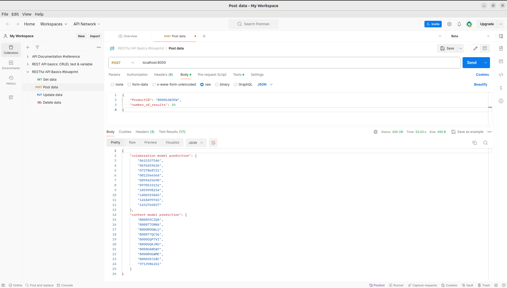

# Amazon Product Recommendation Engine
Two Amazon recommendation engines with API implementation

In this repository, I implemented two recommendation engines that work on Amazon Electronics and Clothing datasets.

# Models
In this project, I deployed a recommendation engine using two different ML models: collaborative filtering and content-based filtering. 

## Content-Based Model
Content-based filtering is used to compare products in the dataset with each other and recommend the most similar products to what the user bought before. The similarity between products is based on their description, title, features, and other attributes of the products. You can find the implementation in [Content_Model.py](Content_Model.py) file. To implement this engine, I used the metadata of the Amazon dataset, which will be discussed in the Dataset section. < br / >

## Collaborative Filtering Model
Collaborative filtering, or Item-Item recommendation, is based on the idea that the best recommendations come from people who have similar tastes. In other words, it uses historical item ratings to predict how someone would rate an item. These methods are based on machine learning and data mining techniques. Compared to other approaches like the memory-based approach, these methods have the advantage of being able to recommend a greater number of items to a greater number of users. Even with huge, sparse matrices, they have a large coverage. I decided to use TruncatedSVD to deploy the model. You can find the implementation in [Collaborative_Model.py](Collaborative_Model.py) file. Two pictures below demonstrate the recommendation for a product with the title: "Timex mens t2e511 classic silvertone stainless steel bracelet watch". They also show the relation between the title of these recommendations and the original product.
To implement this engine, I used the review from the Amazon dataset, which will be discussed in the Dataset section.

# Dataset
In this project, I used Amazon Electronics and Clothing datasets released in 2018. You can find the dataset via the link [Amazon Dataset](https://cseweb.ucsd.edu/~jmcauley/datasets/amazon_v2/#files).

## Pre-processing of the data

### Meta Data
The preprocessing required for the metadata is based on the data frame itself. After downloading the two datasets and merging them together, a number of processing steps need to be applied for the data to be used for model prediction and evaluation.
1. There are many columns available in the dataset that will not be used for the purpose of building a recommendation engine. I decided to use only the productID, brand, title, category, and image URL columns of the data.
2. After removing redundant columns, there is a need to process the values of each column. I removed lists in columns and replaced them with the value inside those lists, removed NaN values, and removed duplicates.
3. There are many non-alphanumerical characters in the title column. I omitted those characters and removed stop words as well. Also, there are many titles which are just one or two words, therefore, I decided to remove small titles which are smaller than four words.
   
You can find the implementation in the [Dataset.py](Dataset.py) file.

### Review Data
The preprocessing steps here are much less than those for metadata.
1. There are many columns available in the dataset that will not be used for the purpose of building a recommendation engine just like the above. I decided to use only the productID, reviewerID, rating, review text, and summary of the product.
2. After removing redundant columns, there is a need to remove those products which are not in the meta data. I used the unique products in the metadata and filtered the products in the review data.
   
You can find the implementation in the [Dataset.py](Dataset.py) file.

## Visualization
There are many methods in the [Dataset.py](Dataset.py) file to visualize the data. You can visualize the data types with "visualize_data_types" method. Also, you can visualize ratings per user, ratings per product, and overall ratings and get the plot of the most popular products in the dataset via the appropriate methods in [Dataset.py](Dataset.py).

# Run the code
In the very first step, you should run the [main.py](main.py) file to retrieve the datasets and save the models. In this file, the dataset will be downloaded and preprocessed, and the models will be initialized, trained, and saved. You can perform the prediction with both of the engines by running the main. It is advised to run the models and save the .pkl files to use them in the API.

# API
I implemented REST API using the FastAPI library in Python. In the API, first, the meta dataset will be created and saved in the backend because it is needed to perform item-item recommendations. Then, the models will be loaded, and the requests from and to the server are handled in `async def recommend(item: ScoringItem)` method. You can initialize FastAPI and run the model on localhost in the Postman application. Below is a picture of a request for a prediction on the Postman. The request was to return 10 recommendations for the "B00063WE3W" product from each ML model. You can find the recommendations in the box at the bottom of the picture.

#Scalability and Performance
To ensure the performance and scalability of the model, I decided to have the dataset in the backend. To perform a recommendation prediction of content-based filtering, you should have access to all the data to compute the similarities. However, I decided to save the dataset in the backend to prevent it from being passed over to the server repeatedly. I also used only 200,000 data points for meta data and 500,000 data points for the review dataset to perform predictions with more speed. However, these numbers can be changed in the dataset and the model with `create_meta_dataset` and `create_review_dataset` functions.

